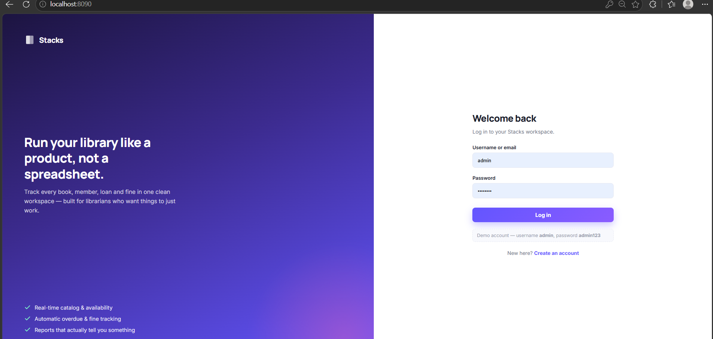
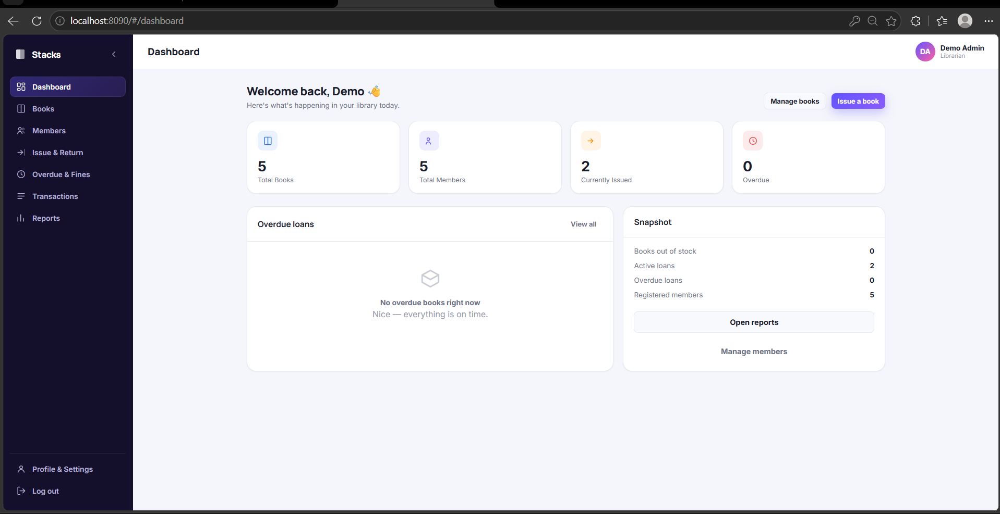
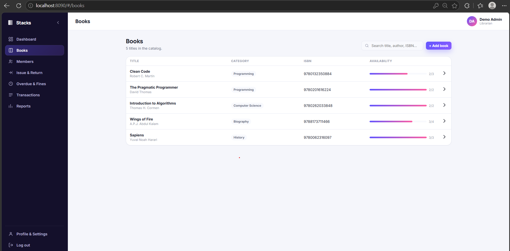
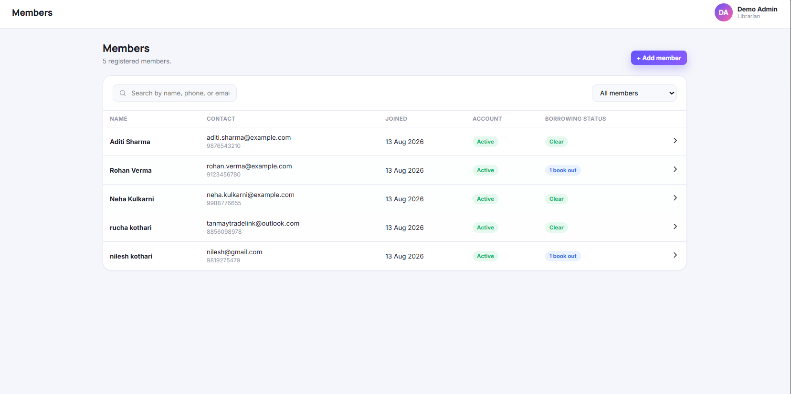
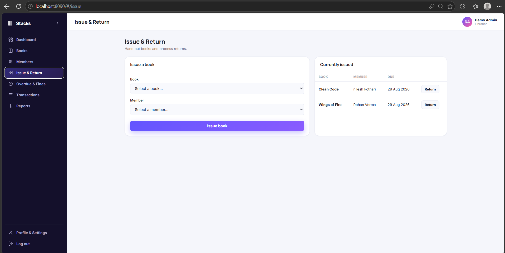
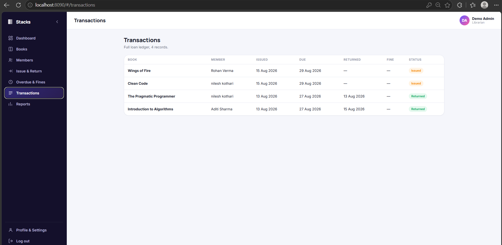
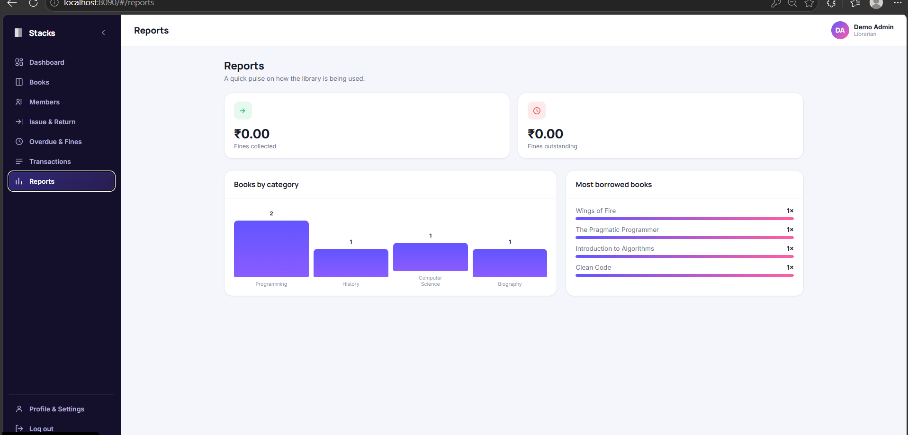

# Library Management System

A full-stack **Library Management System** built with **Java, JDBC, SQLite, HTML, CSS, and JavaScript**. The application provides a web-based interface for managing books, members, book issuing and returns, overdue fines, transactions, reports, user accounts, and profile settings.

The project uses an **embedded SQLite database**, so there is no need to install or configure a separate database server.

## ✨ Features

* 🔐 **User Authentication**

  * Sign up
  * Log in / Log out
  * Edit profile
  * Change password
  * Server-side cookie sessions

* 📚 **Book Management**

  * Add books
  * Edit books
  * Delete books
  * Search books
  * Track total and available copies
  * Category-wise organization

* 👥 **Member Management**

  * Add members
  * Edit members
  * Delete members
  * View member details
  * View borrowing history

* 🔄 **Issue & Return**

  * Issue available books to members
  * 14-day due date
  * Return issued books
  * Automatic availability tracking

* 💰 **Overdue & Fine Management**

  * Detect overdue books
  * Calculate fines automatically
  * Fine rate: **₹5 per day**
  * Track collected and outstanding fines

* 📊 **Dashboard**

  * Total books
  * Available books
  * Members
  * Active issues
  * Overdue loans

* 📋 **Transactions**

  * Complete history of book issues and returns
  * Track transaction details

* 📈 **Reports**

  * Books by category
  * Most borrowed books
  * Fines collected vs. outstanding

* 🗄️ **Database**

  * Embedded SQLite database
  * Automatic database creation
  * Automatic table/schema initialization
  * Sample data on first run

## 📸 Screenshots

### 🔐 Login Page



### 📊 Dashboard



### 📚 Books Management



### 👥 Members Management



### 🔄 Issue & Return



### 📋 Transactions



### 📈 Reports



> **Note:** Make sure the screenshot filenames in the `screenshots` folder exactly match the names used above.

## 🛠️ Tech Stack

| Technology             | Usage                      |
| ---------------------- | -------------------------- |
| **Java 17+**           | Backend                    |
| **JDBC**               | Database connectivity      |
| **SQLite**             | Embedded database          |
| **HTML**               | Web structure              |
| **CSS**                | User interface             |
| **JavaScript**         | Frontend functionality     |
| **HttpServer**         | Java web/API server        |
| **PreparedStatements** | Secure database operations |

## 📁 Project Structure

```text
Library-Management-System/
│
├── database/
│   ├── library_db.sql
│   └── library.db
│
├── src/
│   ├── Book.java
│   ├── Member.java
│   ├── Transaction.java
│   ├── User.java
│   ├── BookDAO.java
│   ├── MemberDAO.java
│   ├── TransactionDAO.java
│   ├── UserDAO.java
│   ├── PasswordUtil.java
│   ├── DBConnection.java
│   ├── SchemaInitializer.java
│   ├── SqlDates.java
│   ├── JsonUtil.java
│   ├── Main.java
│   └── ApiServer.java
│
├── web/
│   ├── index.html
│   ├── style.css
│   └── app.js
│
├── lib/
│   └── sqlite-jdbc-3.53.2.1.jar
│
├── screenshots/
│   ├── login.png
│   ├── dashboard.png
│   ├── books.png
│   ├── members.png
│   ├── issue-return.png
│   ├── transactions.png
│   └── reports.png
│
└── README.md
```

## 🚀 Setup & Run

### 1. Open the project

Open the project folder in **VS Code** or any Java-supported IDE.

### 2. Open Terminal

Navigate to the project root:

```bash
cd "C:\Users\Shree\Desktop\LibraryManagementSystem"
```

### 3. Compile the Java files

```bash
cd src
javac -d ../out *.java
```

### 4. Start the server

Go to the output folder:

```bash
cd ../out
```

On **Windows**:

```bash
java -cp ".;../lib/sqlite-jdbc-3.53.2.1.jar" ApiServer
```

On **macOS/Linux**:

```bash
java -cp ".:../lib/sqlite-jdbc-3.53.2.1.jar" ApiServer
```

### 5. Open the application

Open your browser and visit:

```text
http://localhost:8090
```

## 👤 Demo Login

On the first run, the application automatically creates a demo account.

```text
Username: admin
Password: admin123
```

You can also create your own account using the **Sign Up** option.

## 🗄️ Database

The application uses an embedded **SQLite** database.

No separate MySQL or SQLite server is required.

On the first run:

* Database file is created automatically.
* Required tables are created automatically.
* Sample books and members are added.
* Demo login account is created.

The database file is:

```text
database/library.db
```

### Reset Database

To reset the application data, delete:

```text
database/library.db
```

Then restart the application.

The database will be recreated automatically with the initial demo data.

## 🔌 Change Port

The default port is:

```text
8090
```

You can start the application on another port:

```bash
java -cp ".;../lib/sqlite-jdbc-3.53.2.1.jar" ApiServer 8095
```

Then open:

```text
http://localhost:8095
```

## 🔒 Security

The project includes several basic security practices:

* Passwords are stored using salted SHA-256 hashing.
* Database operations use `PreparedStatement`.
* User sessions are maintained server-side.
* Database transactions use commit/rollback where required.
* User authentication is required for protected application features.

## 🧩 Architecture

The project follows a simple layered structure:

```text
Frontend
   ↓
HTML / CSS / JavaScript
   ↓
Java HTTP API Server
   ↓
DAO Layer
   ↓
SQLite Database
```

The **DAO (Data Access Object)** pattern is used to separate database operations from the application logic.

Main DAO classes include:

* `BookDAO`
* `MemberDAO`
* `TransactionDAO`
* `UserDAO`

## 📝 Main Modules

| Module          | Description                            |
| --------------- | -------------------------------------- |
| Authentication  | User registration and login            |
| Dashboard       | Library statistics and overdue summary |
| Books           | Book catalog and availability          |
| Members         | Member records and borrowing history   |
| Issue & Return  | Book circulation management            |
| Overdue & Fines | Fine calculation and overdue tracking  |
| Transactions    | Complete issue/return history          |
| Reports         | Library statistics and analysis        |
| Profile         | User profile and password management   |

## 🎯 Project Objective

The main objective of this project is to develop a simple, reliable, and user-friendly library management system that reduces manual work involved in maintaining library records.

The system demonstrates practical implementation of:

* Object-Oriented Programming
* JDBC
* Database Management
* CRUD Operations
* Authentication
* Web APIs
* DAO Pattern
* Transaction Management
* Frontend and Backend Integration
